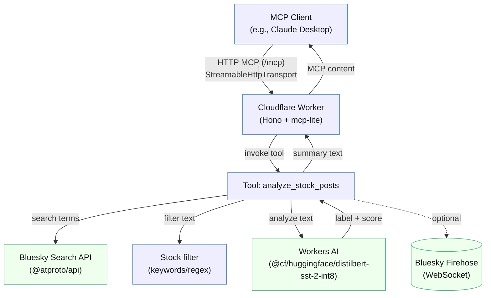

# Architecture Overview

This diagram shows how the Bluesky Stock Sentiment MCP server is wired end‑to‑end.

Key files
- `src/index.ts` — Hono app, MCP server wiring, and routes.
- `src/mcp/tools.ts` — Registers `analyze_stock_posts` and implements handler.
- `src/lib/bluesky-api.ts` — Queries Bluesky search for recent posts.
- `src/lib/stock-filter.ts` — Heuristic keyword/regex filtering for stock posts.
- `src/lib/sentiment.ts` — Workers AI sentiment classification.

Notes
- The MCP endpoint is served at `/mcp` using `mcp-lite` over HTTP.
- Workers AI runs the `@cf/huggingface/distilbert-sst-2-int8` text classification model by default.
- The firehose collector is an optional reference and not wired into the Worker route.
